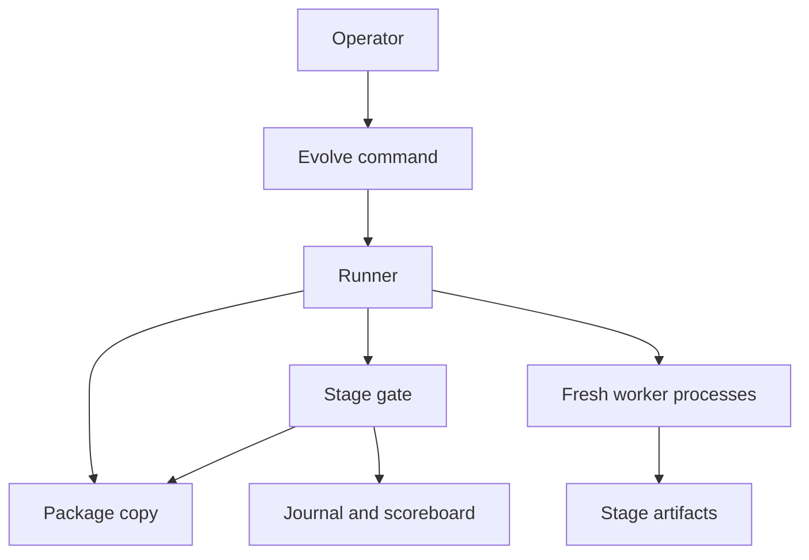
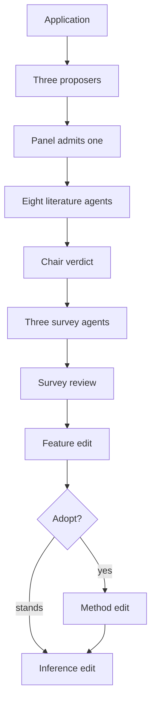
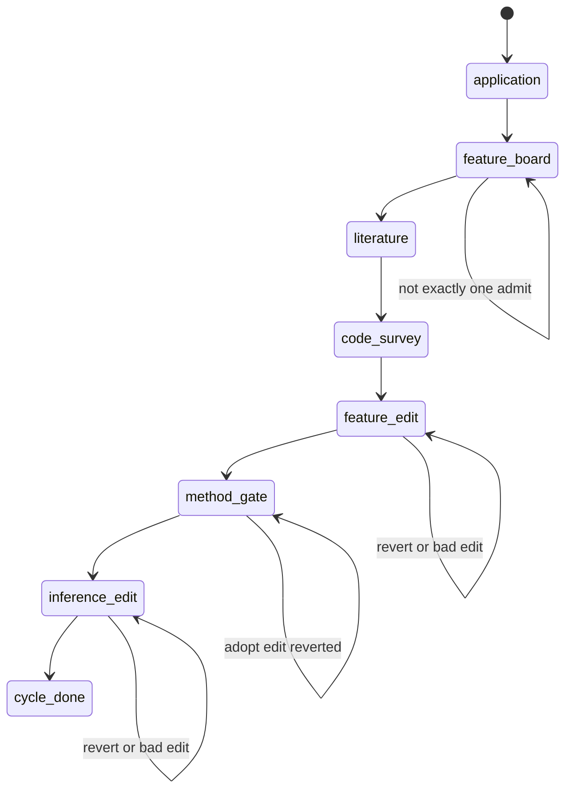
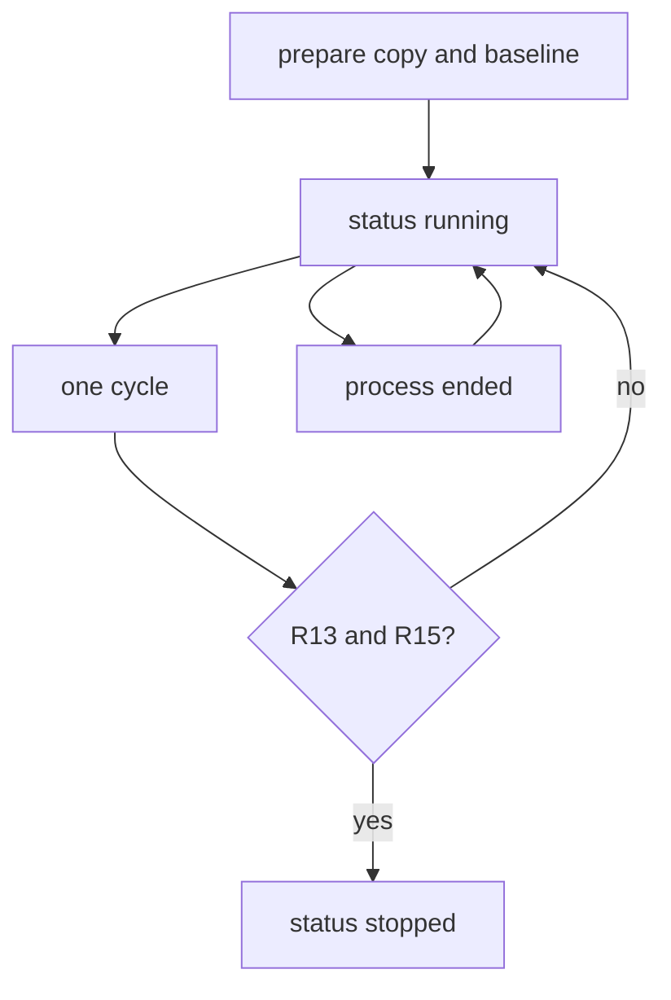
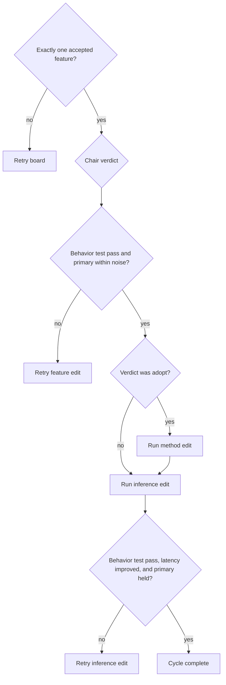
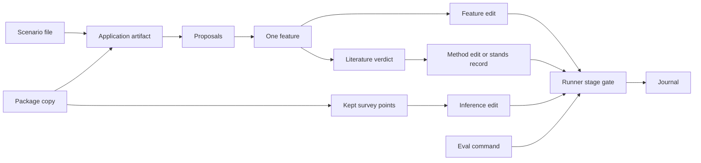

# Stage Cycle Optimizer - Plan

**Target repo:** AbsoluteV1.0

---

## Goal Capsule

- **Objective:** Replace the metric-only evolve cycle with an application, feature-board, literature, code-survey, and three-edit cycle that a later session starts with one command.
- **Authority:** Product behavior is the Requirements. The runner is the only process that evals, keeps, or reverts. `judge` on the gated command stays the beat-best predicate (KTD1).
- **Stop:** The evolve run stops only under R15. Plateau, `max_cycles`, and a stage-attempt cap do not stop it.
- **Execution profile:** Test-first on the new keep predicates and on the toy demonstration. The package-copy edit workers use test-driven development and verification only.
- **Tail:** Local verification with `python -m unittest discover -s tests`. This tree is not a git repository. Do not initialize one for the framework. The runner may still commit a keep on the package copy.

---

## Product Contract

### Summary

Absolute keeps optimizing a copied algorithm stack until the primary metric is at its target and the latest method verdict is either "the current method stands" or an adopted method that was kept. One cycle writes the application when the scenario changes, admits one feature, researches that feature, surveys the code, then measures a feature edit, a method edit when research says to adopt, and an inference edit. The runner launches each stage as a fresh process, runs the eval, and keeps or reverts.

### Problem Frame

The current evolve loop researches the metric, picks one change level, and keeps only when the primary beats the best score by more than the noise margin. That loop cannot admit a product feature that merely holds the metric, cannot require a latency improvement, and stops as soon as the primary hits the target even when the method record is unfinished.

### Requirements

**Command and copy**

- R1. The evolve command accepts a package, a scenario file, a primary metric, a direction, a noise margin, a target, and an eval command, with the eval command last.
- R2. The runner never edits the original tree. It works on a copy that omits `build`, `install`, and `log`.

**Cycle stages**

- R3. The runner launches each stage as a fresh process. Workers do not score and cannot mark a keep.
- R4. Application runs on the first cycle and again only when the scenario file content changes. Those agents read the package copy and the scenario text, and they write what the software is for, who uses it, and which outputs matter. They do not receive the eval path.
- R5. Several agents propose features from that application, including features the user did not name. A separate panel accepts or rejects each proposal in writing, rejects a proposal that only restates a named metric penalty, and admits exactly one feature. Any other count retries the board.
- R6. Six to eight literature agents use disjoint queries covering candidate methods, evidence those methods are current, integration constraints in this stack, and measured cost. One chair merges them, drops duplicates, and writes either "adopt this method" or "the current method stands", each with citations. Another agent is launched only with a new disjoint query.
- R7. A code survey runs every cycle, separate from literature. Several agents read the package copy and name hot paths, algorithmic complexity, extra copies, and dependencies that dominate inference. They do not receive the eval path. A short review keeps the points that affect the admitted feature or the measured latency.

**Measured edits**

- R8. Three measured edits run one at a time. Each edit process is limited to test-driven development and verification. It does not commit, open a worktree, ask a person to sign the design, or run finishing or merge.
- R9. The feature edit is kept only when its behavior test passes and the primary does not worsen by more than the noise margin versus the pre-edit value. Otherwise the runner reverts and retries this stage.
- R10. The method edit runs only when literature said to adopt. It is kept only when the same behavior test passes and the primary does not regress. When literature said the current method stands, the runner records that and does not edit.
- R11. The inference edit always runs and uses the kept survey points. It is kept only when latency, or the profile field the eval already prints, improves by more than the noise margin, and the behavior test and the primary do not regress. Otherwise the runner reverts and retries this stage.
- R12. A failed eval, a bad edit, or a revert retries that same stage and does not advance the cycle.
- R13. A cycle is complete only when the feature edit is kept, the method gate has a verdict, and the inference edit is kept. The method gate is the stands record, or the kept adopt edit.

**Stop and authority**

- R14. Plateau and `max_cycles` do not stop the run. The budget is process lifetime.
- R15. The run stops only when the primary has hit the target and the latest method verdict is "the current method stands", or that latest verdict is adopt and that method edit has been kept.
- R16. The runner is the only process that runs the eval and keep-or-revert. Agents that brainstorm, review, research, or edit do not read or write the scorer.

**Proof**

- R17. The tests lock this cycle. One run on the small toy stack, not on pps, passes a revert and then completes the feature edit, the method edit, and the inference edit.

### Actors

- A1. Operator. Starts and resumes the evolve command.
- A2. Runner. Copies, launches, evals, keeps, reverts, and stops.
- A3. Worker. One fresh process for one stage. Writes an artifact. Does not score.

### Flows

- F1. Start and complete an adopt cycle
  - **Trigger:** A1 starts the command in R1 on a package whose baseline is not yet a finished run.
  - **Actors:** A1, A2, A3
  - **Steps:** A2 copies the package, baselines the eval, then runs R4 through R11. Literature adopts. Each edit is kept. R15 is checked only after R13.
  - **Outcome:** The run stops when R15 holds. The original tree is unchanged.
  - **Covered by:** R1, R2, R13, R15, R17

- F2. Current method stands
  - **Trigger:** The literature chair writes that the current method stands.
  - **Actors:** A2, A3
  - **Steps:** A2 records the verdict and skips the method edit. The feature edit and the inference edit still have to be kept.
  - **Outcome:** The cycle can complete under R13 without a method edit.
  - **Covered by:** R10, R13

- F3. Stage failure
  - **Trigger:** An eval fails, an edit is bad, a keep predicate fails, or a stage artifact is not the required shape.
  - **Actors:** A2
  - **Steps:** A2 restores the package copy to the pre-stage head and relaunches only that stage.
  - **Outcome:** Application, the board, literature, and the survey are not repeated unless that stage is the one that failed.
  - **Covered by:** R12

- F4. Resume
  - **Trigger:** The runner process ends while `status` is running.
  - **Actors:** A1, A2
  - **Steps:** A1 resumes the same run folder. A2 continues the unfinished stage.
  - **Outcome:** No new run id is allocated.
  - **Covered by:** R14

### Acceptance Examples

- AE1. Command order
  - **Covers R1.**
  - **Given** a package, a scenario file, and an eval command.
  - **When** A1 starts evolve with those arguments and the eval last.
  - **Then** the run starts, and a later session can read that same command in `SKILL.md`.

- AE2. No-gain feature
  - **Covers R9.**
  - **Given** a feature edit whose behavior test passes and whose primary moves by less than the noise margin.
  - **When** A2 scores that stage.
  - **Then** the edit is kept.

- AE3. Worsened feature
  - **Covers R9, R12.**
  - **Given** a feature edit whose primary worsens by more than the noise margin.
  - **When** A2 scores that stage.
  - **Then** the copy is restored and only the feature edit is retried.

- AE4. Stands skips the method edit
  - **Covers R10.**
  - **Given** a kept feature and a stands verdict with citations.
  - **When** the method gate runs.
  - **Then** no method-edit process starts, and the inference edit still runs.

- AE5. Target after the feature keep
  - **Covers R13, R15.**
  - **Given** a kept feature that puts the primary on target, and no method verdict yet.
  - **When** that keep is recorded.
  - **Then** the run stays running through the method gate and the inference edit.

- AE6. Toy revert then three edits
  - **Covers R17.**
  - **Given** the toy stack and a fixture worker that reverts once, then keeps a feature, an adopted method, and an inference edit.
  - **When** the evolve command runs to completion.
  - **Then** the journal shows that revert and those three keeps, the original toy file is unchanged, and the scorer file bytes are unchanged.

### Scope Boundaries

- The gated `admit` / `cycle` command keeps today's beat-best `judge` and the three-implementation streak.
- Workers do not commit, open a worktree, request a design signature, or run finishing or merge. The runner may commit a keep on the package copy.
- pps is not a demonstration target.

### Deferred to Follow-Up Work

- A wall-clock budget flag.
- A live model demonstration. The proof is the fixture subprocess in R17.
- Dynamic literature growth beyond one replacement query (KTD2).

### Outside this product's identity

- Editing `pps_v3.4_ros`, or the Absolute tree outside this repo.
- Letting a worker read or write the scorer, or mark a keep.

---

## Planning Contract

### Key Technical Decisions

- KTD1. Evolve stage keeps use a new runner-only predicate. Gated `judge` stays "keep only when the primary beats the best by more than noise."
  - **Rationale:** R9 and R11 cannot be implemented on that predicate. A no-gain feature and a latency-only inference edit would revert. The one challenge to "keep the keep-or-revert rule frozen" resolves as authority, not predicate: A2 still scores, A3 still cannot mark a keep, and the gated command is untouched.
  - **Governs:** R9, R10, R11, R16

- KTD2. Literature launches eight fixed disjoint queries, two for each topic in R6, then one chair. A worker that returns an unusable artifact is replaced by one new query that does not repeat a prior query.
  - **Rationale:** Eight is inside the six-to-eight range and gives every topic two queries. A chair-spawned loop is a second scheduler.
  - **Governs:** R6

- KTD3. The edit artifact names the behavior-test command. The runner runs that command in the package copy and requires exit 0 before the metric predicate. The runner rejects the command when it matches the eval command or names an immutable scorer file.
  - **Rationale:** The product is any stack, so a hard-coded Python discovery command is the wrong gate. Letting the worker name the command, then checking it, keeps the eval out of the worker's hands.
  - **Governs:** R9, R10, R11, R16

- KTD4. Worker briefs and prompt text omit the eval command and scorer paths. The panel brief receives the primary metric name, and any protected metric names, as the named penalties in R5. Prompts forbid opening the scorer and immutable files.
  - **Rationale:** R4, R7, and R16 forbid the eval path. The panel cannot reject a scorer penalty by reading the scorer. Metric names are already operator input.
  - **Governs:** R4, R5, R7, R16

- KTD5. `scoreboard.cycles` increments once when R13 holds. The journal records every edit attempt. The R15 check runs only then. A feature keep that hits the target does not stop the run.
  - **Rationale:** Today's `apply_stops` stops on the primary alone, which cuts the cycle before R13.
  - **Governs:** R13, R15

- KTD6. Evolves with `loop=until_target` do not apply the three-implementation streak. The gated command still does.
  - **Rationale:** Inference runs every cycle. The streak would block it after three keeps.
  - **Governs:** R11

- KTD7. The inference field is `latency_ms` when the eval JSON contains it. Improvement means a decrease of more than the same noise margin versus the pre-edit value. A missing field is an eval failure and retries that stage.
  - **Rationale:** The toy eval already prints `latency_ms`. The command in R1 has no separate profile flag.
  - **Governs:** R11

- KTD8. Toy latency is a value in package code that `evaluate.py` reads. `evaluate.py` stays immutable for the run.
  - **Rationale:** A hardcoded `latency_ms` cannot move unless the scorer is edited, which R16 forbids.
  - **Governs:** R16, R17

- KTD9. The scenario path and a content hash are stored on the run record. Application agents receive the scenario text. Only the operator changes the scenario file.
  - **Rationale:** R4 needs a stable identity for "the scenario file changed" without copying the scenario into the package.
  - **Governs:** R4

- KTD10. The feature board is three proposers and one panel. The survey is three readers and one review. Launches reuse the current parallel worker launch.
  - **Rationale:** "Several" matches the current three-way cluster. The panel and the review are one fresh process each.
  - **Governs:** R5, R7

- KTD11. There is no duration flag. Stage retries are not capped by plateau, `max_cycles`, or `STAGE_ATTEMPTS`. A killed runner leaves `status=running` for resume.
  - **Rationale:** R14 names process lifetime as the budget. `STAGE_ATTEMPTS` currently aborts the process, which is a stop.
  - **Governs:** R12, R14

- KTD12. Same-stage retry restores the package copy to the pre-stage head and relaunches only that stage. Upstream artifacts for this cycle stay.
  - **Rationale:** R12 says the cycle does not advance and does not restart finished stages.
  - **Governs:** R12

- KTD13. `run.json` stores the current stage name. Resume continues that stage in the same run folder.
  - **Rationale:** F4 needs a cursor. A fresh cycle would repeat finished stages.
  - **Governs:** R14

### High-Level Technical Design

Components. The runner owns copy, launch, eval, keep, and stop. Workers only write stage artifacts.

Protocol for one cycle. Each box is a fresh process except the runner gates.

Stage state. A failed gate returns to the same state.

Run lifecycle. Baseline-at-target still enters the cycle because no method verdict exists yet.

Decision gates the runner applies. Workers do not take these branches.

Data flow. The eval command stays on the runner side of the line.

### Assumptions

- Eight literature queries satisfy R6. Six would also fit the range. The plan uses eight so each topic has two queries.
- The behavior test is the validated command in KTD3. The plan does not add a test-command flag to R1.
- The fixture moves the primary on the feature or method keep so R17 can stop. The runner does not put a hidden beat-best rule back on those stages.
- A scorer file may sit inside the package when it is immutable. Briefs still omit its path (KTD4, KTD8).
- Protected metrics stay an empty list on evolve charters. Stage gates do not add a protected-metric veto.
- The panel is one process that writes an accept or reject for every proposal (KTD10).

### Sequencing

U1 stores the scenario and stops treating baseline-at-target as a finished run. U2 adds the stage predicate and the R15 stop without changing gated `judge`. U3 adds roles and strips the eval path from briefs. U4 wires the cycle. U5 is the toy proof and the `SKILL.md` command.

---

## Implementation Units

### U1. Record the scenario and keep a baseline-at-target run alive

- **Goal:** The evolve command accepts the scenario file and remembers its content hash, and a baseline that already hits the target does not skip workers.
- **Requirements:** R1, R2, R4, R15
- **Dependencies:** none
- **Files:** `absolute/cli.py`, `absolute/loop.py`, `absolute/package.py`, `tests/test_evolve.py`
- **Approach:**
  1. Add the scenario path to the evolve parser before the eval remainder.
  2. Persist the path and content hash on the run record (KTD9).
  3. Leave `copy_package` skipping `build`, `install`, and `log`.
  4. Do not set stopped when the baseline already hits the target. R15 is not knowable yet (KTD5).
- **Execution note:** Extend the existing evolve command tests first, and observe the missing-scenario failure before changing the parser.
- **Patterns to follow:** `cmd_evolve` and `build_charter` in `absolute/loop.py`. `IGNORE_DIRS` in `absolute/package.py`.
- **Test scenarios:**
  - Happy path: evolve invoked with package, scenario, metric, direction, noise, target, and eval last stores the scenario hash and starts `status=running`.
  - Edge: a second prepare against the same scenario bytes keeps the same hash. A one-byte scenario change stores a new hash.
  - Error: a missing scenario path fails before a package copy is created.
  - Integration: a package that contains `build`, `install`, and `log` directories copies without those directories, and the original tree's file bytes are unchanged.
  - Edge: baseline JSON already meets the target, and the run stays `running` with no stop reason.
- **Verification:** The new tests fail before the parser and prepare changes, then pass. Gated command tests still pass.

### U2. Score the three edit stages without changing the gated judge

- **Goal:** The runner can keep a no-gain feature, skip or keep a method edit, keep a latency improvement, and refuse to stop on target alone.
- **Requirements:** R9, R10, R11, R13, R15, R16
- **Dependencies:** U1
- **Files:** `absolute/engine.py`, `tests/test_evolve.py`
- **Approach:**
  1. Add a runner-only stage gate beside `judge` (KTD1). Do not change `judge`'s beat-best comparison.
  2. Feature and method gates compare the primary with the pre-edit value using the noise margin as a non-regression budget (R9, R10).
  3. The inference gate requires `latency_ms` to decrease by more than that noise, and the primary to stay inside the same budget (KTD7).
  4. Run the behavior-test command from KTD3 before the metric comparison. A rejected command or a non-zero exit is a bad edit.
  5. On `until_target`, do not stop from the primary alone, and do not apply the implementation streak (KTD5, KTD6).
- **Execution note:** Write the predicate tests first and observe keep-versus-revert failures before changing `engine.py`.
- **Patterns to follow:** `runner_authority`, `_within_budget`, and `cycle` in `absolute/engine.py`. Leave `tests/test_absolute.py` on the gated path.
- **Test scenarios:**
  - Happy path: primary unchanged, behavior test exit 0, feature gate returns keep (AE2).
  - Happy path: `latency_ms` drops by more than noise and the primary holds, inference gate returns keep.
  - Edge: primary worsens by more than noise, feature gate returns revert (AE3).
  - Edge: `latency_ms` absent, inference gate is an eval failure.
  - Error: behavior-test command equal to the eval command is a bad edit and does not run.
  - Error: a behavior-test command that names an immutable scorer file is a bad edit and does not run.
  - Error: an unarmed caller cannot invoke the stage gate.
  - Integration: a feature keep that lands on the target leaves `status=running` (AE5).
  - Integration: gated `judge` still reverts a no-gain change. The three-implementation streak still rejects a fourth gated implementation admit.
- **Verification:** New predicate tests pass. Existing gated keep, revert, and streak tests pass without modification.

### U3. Add stage roles whose briefs omit the eval path

- **Goal:** Application, feature board, literature, survey, and edit prompts render, and no worker brief contains the eval command.
- **Requirements:** R3, R4, R5, R6, R7, R8, R16
- **Dependencies:** U1
- **Files:** `absolute/prompts.py`, `absolute/loop.py`, `tests/test_evolve.py`
- **Approach:**
  1. Add roles for application, feature proposal, feature panel, literature, literature chair, survey, survey review, and edit. Edit stays one role. The stage name distinguishes feature, method, and inference.
  2. Build briefs from KTD4. Application and survey briefs include the package copy and not the eval command. Application also includes the scenario text (KTD9).
  3. The panel brief includes the metric names and the proposals, not the eval command.
  4. The edit prompt limits the worker to test-driven development and verification, and forbids commit, worktree, a design signature, finishing, and merge (R8). It does not include the eval command.
  5. Literature query text is eight disjoint strings, two per R6 topic (KTD2).
- **Execution note:** Assert the current edit brief still contains the eval command, then strip it and add the new roles.
- **Patterns to follow:** `render_prompt` and `_base_brief`. Unknown roles still raise.
- **Test scenarios:**
  - Happy path: each new role renders a prompt that names its job and does not contain the eval executable or the scorer path.
  - Happy path: eight literature queries are non-empty and pairwise disjoint.
  - Edge: the panel prompt names the primary metric and tells the panel to reject a proposal that only restates it.
  - Error: an unknown role still raises.
  - Integration: a materialized worker brief file for an application process has no eval-command field.
- **Verification:** Prompt tests pass, including the edited assertion that worker briefs omit the eval path.

### U4. Run one cycle as ordered stages with same-stage retry

- **Goal:** `one_cycle` performs R4 through R13 in order, retries only the failed stage, and resumes at the stored stage.
- **Requirements:** R3, R4, R5, R6, R7, R8, R12, R13, R14
- **Dependencies:** U2, U3
- **Files:** `absolute/loop.py`, `absolute/engine.py`, `tests/test_evolve.py`, `tests/fixtures/scheduled_worker.py`
- **Approach:**
  1. Replace the research-then-one-edit body of `one_cycle` with the protocol diagram. Reuse the parallel launcher.
  2. Skip application when the stored scenario hash matches (KTD9).
  3. Accept a panel artifact only when it accepts exactly one proposal and rejects the rest (R5, KTD10). Otherwise retry the board (KTD12).
  4. Require the chair artifact to be adopt or stands, with citations (R6). Stands records the verdict and does not launch a method edit (R10).
  5. Launch the three edits one at a time. Score each with the U2 gate. On revert, eval failure, or bad edit, restore and relaunch that edit only (KTD12, KTD11).
  6. Persist the stage name (KTD13). Increment `scoreboard.cycles` only when R13 holds (KTD5).
- **Execution note:** Drive a fixture worker through one failed feature edit and assert the literature artifact is not regenerated, before wiring the success path.
- **Patterns to follow:** `_launch_all`, `_retry`, and `parse_decision` in `absolute/loop.py`. Replace `parse_decision`'s old level set for this loop. Leave the gated parser behavior covered by `tests/test_absolute.py`.
- **Test scenarios:**
  - Happy path: one cycle launches application, three proposers, one panel, eight literature agents, one chair, three survey agents, one review, then feature, method, and inference edits as distinct processes.
  - Happy path: a stands verdict launches no method-edit process (AE4).
  - Edge: the second cycle with an unchanged scenario hash does not launch application.
  - Edge: a changed scenario hash launches application again.
  - Error: a panel that accepts zero or two proposals retries the board and does not launch literature.
  - Error: a feature revert restores the copy and does not relaunch literature (AE3, F3).
  - Integration: killing the runner after the feature keep, then resuming that folder, continues at the method gate and does not allocate a new run id (F4).
- **Verification:** Fixture-driven cycle tests pass. A revert is followed by the same stage, not by a new outer cycle that repeats research.

### U5. Prove a revert and all three edits on the toy stack

- **Goal:** A subprocess evolve on the toy stack reverts once, then keeps a feature edit, an adopted method edit, and an inference edit, and `SKILL.md` tells a later session the command.
- **Requirements:** R1, R8, R15, R17
- **Dependencies:** U4
- **Files:** `examples/toy_stack/algo_v1.1/algo.py`, `examples/toy_stack/algo_v1.1/evaluate.py`, `tests/fixtures/scheduled_worker.py`, `tests/test_evolve.py`, `SKILL.md`, `README.md`
- **Approach:**
  1. Move toy latency into package code that the eval reads (KTD8). Leave the eval file immutable during the run.
  2. Teach the scheduled worker the new roles. Its literature chair adopts a method. Its first feature edit worsens the primary. The retry keeps the feature, adds a behavior test, and moves the primary to the target. The method edit keeps. The inference edit lowers latency by more than the noise margin.
  3. Rewrite the `SKILL.md` cycle so the command is package, scenario, metric, direction, noise, target, and eval last, and the stages match R4 through R15. Update the `README.md` command so it does not contradict `SKILL.md`.
- **Execution note:** Update the toy and the fixture, then run one subprocess evolve and read the journal before editing surrounding tests to match that journal.
- **Patterns to follow:** `test_subprocess_evolve_continues_past_a_revert_until_the_target` in `tests/test_evolve.py`. The current scheduled worker's odd-cycle revert.
- **Test scenarios:**
  - Happy path: the subprocess journal contains one revert and then keeps for feature, method, and inference, and the run stops under R15 (AE6).
  - Happy path: worker prompts for the three edits mention test-driven development and verification, and do not mention commit, worktree, or finishing-a-development-branch.
  - Edge: `latency_ms` in the final eval is lower than the baseline by more than noise, and the primary is on target.
  - Error: the eval file's bytes after the run match the bytes after the copy, and the original `algo.py` still has its starting value.
  - Integration: `SKILL.md` contains the R1 command with eval last, and does not describe the old research-cluster-then-one-edit cycle as the current loop.
- **Verification:** The subprocess test passes on the toy stack. `SKILL.md` matches the command the test invokes.

---

## System-Wide Impact

- Worker briefs lose `eval_command`. Any test that required research or edit prompts to echo the eval command has to be rewritten.
- `apply_stops` for `until_target` no longer treats the primary alone as stop. Resume and handoff text must say the run also needs the method gate (R15).
- The journal gains one entry per edit attempt, and `scoreboard.cycles` counts completed cycles (KTD5). Fixture assertions that expect two cycles for revert-then-keep must change.
- A file-reading worker that opens `charter.json` can still discover the eval path. KTD4 is the enforced boundary: briefs, prompts, and tests. The residual risk is recorded under Risks.

---

## Risks and Dependencies

- An inference edit that cannot move `latency_ms` retries for the life of the process (KTD11). The toy must expose a package field the fixture can change (KTD8).
- The stage gate and `judge` can drift. U2 keeps a gated test that still expects beat-best, so a shared-helper "cleanup" would fail that test.
- The panel's penalty rejection is only as good as the metric names in the brief. The runner's check is "exactly one accept", not a reading of the scorer (KTD4).
- Depends on the existing copy, launch, and `runner_authority` behavior. No new third-party library.

---

## Documentation and Operational Notes

- `SKILL.md` is the operator contract for the later session (R1, U5).
- `README.md` repeats the command and must be updated in the same unit.
- The framework tree has no git repository. Do not create one. The package copy's own repo remains the runner's keep and revert mechanism.

---

## Sources and Research

- `absolute/loop.py` sequences research, one decision, and one edit, and merges research in the runner.
- `absolute/engine.py` `judge` keeps only a primary improvement beyond noise. `apply_stops` on `until_target` stops when the primary hits the target. `admit` blocks a fourth consecutive implementation keep.
- `absolute/prompts.py` knows the roles research, propose, chair, and edit. Edit text currently includes the eval command.
- `absolute/package.py` already skips `build`, `install`, and `log`.
- `examples/toy_stack/algo_v1.1/evaluate.py` prints a constant `latency_ms` plus `algo.VALUE`.
- `tests/test_evolve.py` locks the old command, three research queries, next-cycle repair, and baseline-at-target with no workers.
- `tests/test_absolute.py` locks gated beat-best and the implementation streak. Those stay.
- No `docs/solutions` corpus and no `CONCEPTS.md` exist in this tree.

---

## Verification Contract

| Gate | Command | Applies to |
| --- | --- | --- |
| Unit and subprocess tests | `python -m unittest discover -s tests` | U1 through U5 |
| Toy demonstration | the subprocess evolve test that covers AE6 | U5 |
| Gated regression | the existing `tests/test_absolute.py` cases for beat-best and the implementation streak | U2 |

No release validation and no browser check. This change has no UI.

---

## Definition of Done

- R1 through R17 are covered by the unit scenarios in U1 through U5, and AE6 has been observed as a passing subprocess run.
- `judge` on the gated path still reverts a change that does not beat the best score.
- Worker briefs for the new roles omit the eval command.
- The original toy source is unchanged after the demonstration, and the copied eval file's bytes match the pre-edit bytes.
- Abandoned experimental code from this work is not left in the diff.
- `SKILL.md` describes the stage cycle and the R1 command.
