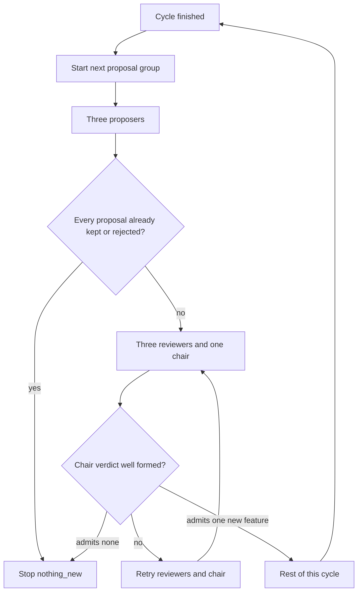
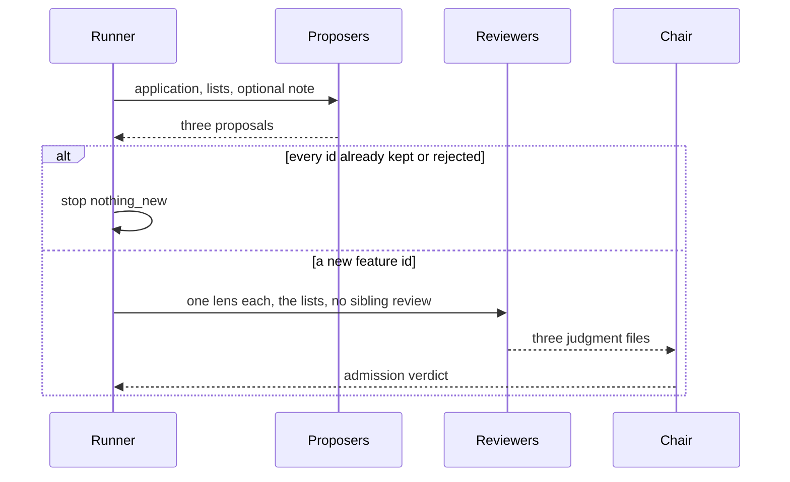
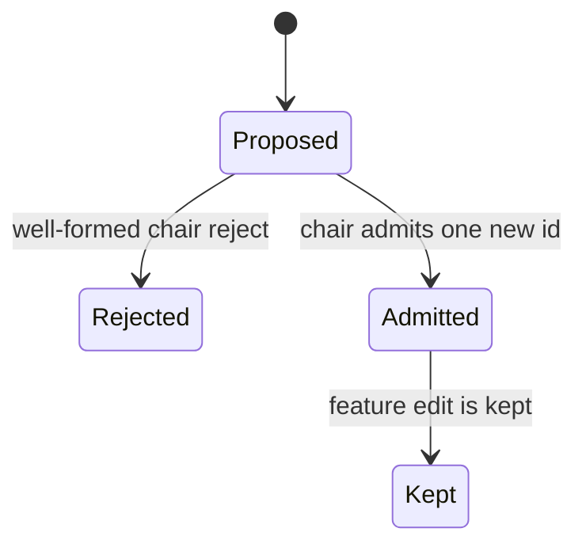

# Proposal Continuation - Plan

**Target repo:** AbsoluteV1.0

---

## Goal Capsule

- **Objective:** A finished evolve cycle always starts the next feature-proposal group. The run stops when that group admits nothing new.
- **Authority:** Requirements win on product behavior. Key Technical Decisions win on mechanism. The runner is the only process that scores, keeps, reverts, or stops.
- **Stop:** The product stop is R3. R6 names the conditions that do not stop the run. R9 is a test ceiling and is not a product stop.
- **Execution profile:** Test-first on the empty-admission stop and on the toy demonstration. Edit workers keep today's test-driven development and verification.
- **Tail:** Local verification with `python -m unittest discover -s tests` from this directory. This tree is not a git repository. Do not initialize one.

---

## Product Contract

### Summary

Each finished cycle starts the next feature-proposal group. The metric being at target, a stands verdict, or a kept feature does not cancel that group. The run stops when every proposal in the round is a feature already kept or a feature the panel already rejected. The feature panel becomes independent reviewers and one admission chair, and that review stays on the feature panel. Tests may cap completed cycles. That cap is absent from `SKILL.md`.

### Problem Frame

`complete_cycle` stops an evolve run when the primary metric is at target. `Absolute_2026-09-28_01` already had `scenario_error` at 0, kept `inlier_face_extents`, recorded a stands verdict, kept the inference edit, and exited with `stop_reason` `target`. The next feature board never started.

### Key Decisions

- Continuation. (session-settled: user-directed — chosen over stopping when the metric is at target and the method stands or an adopted method was kept: finishing a cycle starts the next proposal group.)
  - Governs R1, R2
- Exhausted proposals. (session-settled: user-directed — chosen over retrying an empty admission, and over plateau, `max_cycles`, a target hit, or a stands verdict as the product stop: the run stops when the round admits nothing new.)
  - Governs R3, R4, R5, R6, R16
- Feature-panel review. (session-settled: user-directed — chosen over one panel agent, and over a review roster on literature, the code survey, the edits, or the outer stop: independent reviewers and one admission chair, only on the feature panel.)
  - Governs R10, R11, R12, R13
- Test ceiling. (session-settled: user-directed — chosen over describing `max_cycles` in `SKILL.md`: tests can stop after a fixed number of completed cycles, and that ceiling is not a product stop.)
  - Governs R9, R15

### Requirements

#### Continuation

- R1. After a cycle is finished, the next cycle's feature proposers start.
- R2. A metric at target, a stands verdict, or a kept feature does not cancel that next group.

#### Stop

- R3. The run stops when a proposal round admits nothing new: every proposal is a feature already kept or a feature the panel already rejected.
- R4. The kept list and the rejected list stay on the run and are given to the next feature board.
- R5. An empty admission is not retried.
- R16. A well-formed chair verdict that admits no feature records those rejections and stops the run under R3.
- R6. The metric being at target, a stands verdict, plateau, and `max_cycles` do not stop the run.

#### Inside a cycle

- R7. Stage order stays application, feature board, literature, code survey, feature edit, method gate only when literature said adopt, then inference edit. A failed eval, a bad edit, or a revert retries that stage.
- R8. The runner scores. A worker cannot mark a keep.

#### Tests and the session

- R9. Tests can stop the loop after a fixed number of completed cycles. That ceiling is not a product stop.
- R15. `SKILL.md` teaches a later evolve session R1 through R8, R3, and R6. It does not describe the R9 ceiling.

#### Feature panel

- R10. The feature panel is independent reviewers plus one admission chair, and that review is not added to literature, the code survey, the edits, or the outer stop.
- R11. The three lenses are the scenario, including features the user did not name; feasibility in this package; and rejection of a proposal that only restates the metric penalty.
- R12. When the chair accepts a feature, that acceptance is exactly one feature, and that feature is not one the lists already contain.
- R13. A review does not score, does not mark a keep, and does not stop the next cycle.
- R14. After a cycle, one short note may be written for the next proposal group.

### Actors

- A1. The evolve runner, which scores, keeps, reverts, and stops.
- A2. Feature proposers, including features the user did not name.
- A3. Lens reviewers.
- A4. The admission chair.
- A5. A later evolve session that follows `SKILL.md`.

### Flows

- F1. At-target continuation
  - **Trigger:** A cycle finishes while the metric is already at target and the method verdict is stands.
  - **Actors:** A1, A2
  - **Steps:** The runner records the finished cycle and starts the next proposal group.
  - **Covered by:** R1, R2
- F2. Nothing new
  - **Trigger:** Every proposal in the round is already kept or already rejected.
  - **Actors:** A1, A2
  - **Steps:** The proposers have run. The runner stops the run. Literature and the edits do not start.
  - **Covered by:** R3, R4, R5
- F3. One admission
  - **Trigger:** The round contains a feature that is not on either list.
  - **Actors:** A1, A3, A4
  - **Steps:** The three reviewers write their lenses. The chair admits one feature. The rest of the cycle follows R7.
  - **Covered by:** R7, R10, R11, R12

### Acceptance Examples

- AE1. At target, the next proposers still launch. Covers F1.
  - **Given:** The toy stack baseline is already at the metric target, and literature's verdict is stands.
  - **When:** One cycle finishes with the feature edit kept and the inference edit kept.
  - **Then:** The next cycle's feature proposers launch, and the run does not stop for the metric or for stands.
- AE2. A known-only round stops. Covers F2.
  - **Given:** The kept list and the rejected list already contain every proposal id.
  - **When:** The proposal group returns.
  - **Then:** The run stops, the board is not retried, and literature does not launch.
- AE3. The chair admits one new feature. Covers F3.
  - **Given:** One proposal id is absent from both lists.
  - **When:** The chair admits that id and rejects the others.
  - **Then:** The cycle continues through R7, and the rejected ids are on the run for the next board.
- AE4. A later session reads the new stop. Covers R15.
  - **Given:** `SKILL.md` after this change.
  - **When:** A later evolve session reads it.
  - **Then:** It continues after a finished cycle until a proposal round admits nothing new, and it does not see a completed-cycle ceiling.
- AE5. A well-formed reject-all stops. Covers R16.
  - **Given:** Three proposal ids are absent from both lists, and the chair rejects each with a reason.
  - **When:** The runner reads that verdict.
  - **Then:** The run stops, those ids are on the rejected list, and literature does not launch.

### Scope Boundaries

- Work is confined to AbsoluteV1.0. The sibling tree `Desktop/AbsoluteV1.0` and `pps_v3.4_ros` stay untouched.
- `runs/Absolute_2026-09-28_01` is not resumed.
- Literature, the code survey, the three edits, and the outer stop do not gain this review roster.
- Plateau and `max_cycles` stay off the product stop. The gated `judge` path stays beat-best.
- Workers still do not receive the eval command. They still cannot mark a keep.

### Deferred to Follow-Up Work

- Matching two different feature ids that describe the same idea.
- Renaming the evolve charter flag `until_target`.
- Removing `feature_catalog` once nothing reads it.

### Outside this product's identity

`evolve` still does not promote. `VALIDATION.md` and `robot_validated` stay as they are.

---

## Planning Contract

### Key Technical Decisions

- KTD1. The product stop writes `status` `stopped` and `stop_reason` `nothing_new`. `one_cycle` returns as soon as that stop is written, without literature and without `complete_cycle`. `complete_cycle` leaves a finished cycle `running`, sets the stage back to `application`, and clears `admitted_feature`. `_ensure_continuable` and `run_cycles` treat `nothing_new` as a finished run, the same way they treat `target` today, and they print `nothing_new`. (session-settled: user-directed — chosen over `stop_reason` `target` after a finished cycle: R3 is the only evolve product stop.)
  - Governs R3, R5, R6
- KTD2. Identity is the exact `feature_id` string. Each list entry stores that id and the proposal summary. The kept list grows only when the feature edit's outcome is keep. The rejected list grows only from a well-formed chair verdict. `feature_catalog` is not the exhaustion list.
- KTD3. After the proposers return, the runner applies R3 before it launches reviewers or the chair. That path is not a `ValueError` inside `_until_ok`.
- KTD4. A new `feature_id` starts three reviewer processes and one chair. Proposals collapse to unique ids before admission. A well-formed verdict admits one new id whose summary is not only the primary metric name, and the rejected list records only the other unique ids. A well-formed verdict that admits none records those rejects and then follows R16. A malformed verdict retries the reviewers and the chair only, and does not write either list.
  - Governs R11, R12
- KTD5. A successful admit sets the stage to `literature` before literature runs. Resume with `admitted_feature` already set does not run the board again. The empty check runs only for a cycle that does not yet have an admitted feature.
- KTD6. The R9 ceiling is an optional argument on the evolve entry the tests call. When completed cycles have reached it, `run_cycles` returns before the next cycle. It does not change `status` or `stop_reason`, it is not `charter.stops.max_cycles`, and `cli.py` does not grow a flag for it.
- KTD7. The R14 note is one string the runner may write at the end of a cycle from the admitted feature and the method verdict. The next proposal briefs include it when present. It is not a worker, and a missing note does not block the next group.

### High-Level Technical Design

The runner owns both lists and the stop. Proposers, reviewers, and the chair write artifacts only.

Reviewer roles are `feature_review_scenario`, `feature_review_feasibility`, and `feature_review_restatement`. The chair role is `feature_admit`. `feature_panel` leaves the evolve path. Briefs are built from `_worker_brief`, so they carry no eval command. Reviewer output is a judgment per proposal. The chair output keeps today's decisions list: `feature_id`, `decision` of `accept` or `reject`, and `reason`.

### Assumptions

- Exact `feature_id` is the identity. A new id is a new feature even when the summary is similar. The R9 ceiling bounds tests if proposers mint ids forever. A live run is bounded by process lifetime.
- When every proposal is already known, reviewers and the chair do not launch. AE1 only requires the next proposers.
- A well-formed chair verdict that rejects every new proposal is an empty admission under R5. A bad chair can end the run. Retrying that verdict forever would defeat the feasibility lens.
- The optional note is runner-written. The user allowed a note and did not ask for another agent.
- `feature_catalog` may still record an admission. Exhaustion reads the two new lists.

### Sequencing

U1, then U2, then U3, then U4. U5 follows U3 and U4. U2 and U3 both edit `absolute/loop.py`, so they stay serial.

---

## Implementation Units

### U1. Classify a proposal round against the run lists

- **Goal:** The runner can tell a known-only round from a round that still has a new feature, and can record keep and reject without stopping on the metric.
- **Requirements:** R3, R4, R5
- **Dependencies:** none
- **Files:** `absolute/engine.py`, `tests/test_evolve.py`
- **Approach:**
  1. Add the kept list and the rejected list on the run.
  2. Classify by KTD2 and KTD3.
  3. Append to the kept list only from a feature-edit keep.
  4. Leave `complete_cycle`'s target stop for U2.
- **Execution note:** Start with a failing test that a known-only round is the empty admission and that a metric at target does not classify the round as stopped.
- **Patterns to follow:** `complete_cycle` and `score_stage` in `absolute/engine.py` for runner-only writes. `save_run` in `absolute/store.py`.
- **Test scenarios:**
  - Happy path: proposals `raise-value` and `extra`, kept list contains `raise-value`, rejected list contains `extra`. The round is empty. No list write treats the metric target as a stop.
  - Edge: an empty kept list and a new id `raise-value` is not an empty round. Two proposals with the same new id are one feature.
  - Error: a feature-edit revert does not append the id to the kept list. A method-edit keep does not append it either.
  - Integration: the lists survive `save_run` and `load_run`.
- **Verification:** The new classification tests pass, and a known-only round is distinguishable from a target hit.

### U2. Leave a finished cycle running until the next board is empty

- **Goal:** Finishing a cycle starts the next proposal group, and a known-only group stops the run.
- **Requirements:** R1, R2, R3, R5, R6, R7, R16
- **Dependencies:** U1
- **Files:** `absolute/loop.py`, `absolute/engine.py`, `tests/test_evolve.py`
- **Approach:**
  1. Change `complete_cycle` per KTD1.
  2. Teach `_ensure_continuable`, `run_cycles`, and `_handoff_instruction` the `nothing_new` stop.
  3. Call the U1 classification from `run_board` after the proposers return and before the panel launch, per KTD3.
  4. When that classification writes `nothing_new`, `one_cycle` returns immediately. It does not launch literature and it does not call `complete_cycle`.
  5. Keep edit retries in `run_edit` as they are.
- **Execution note:** Extend the existing toy evolve tests that currently expect `stop_reason` `target`. Do not add the stands demonstration here.
- **Patterns to follow:** `run_cycles` and `_ensure_continuable` in `absolute/loop.py`. `_handoff_instruction` in `absolute/engine.py`.
- **Test scenarios:**
  - Happy path: Covers AE1's continuation half. Baseline target is already hit, one cycle's feature edit and inference edit are kept, and `status` is still `running` with an empty `stop_reason`.
  - Edge: a second cycle whose three fixture ids are all on the lists stops with `nothing_new`. Literature workers for that cycle are absent. The board function is not entered again by `_until_ok`.
  - Error: a failed eval on the feature edit still retries that stage, and the run is not `nothing_new`.
  - Integration: resume of a folder already stopped with `nothing_new` returns without launching workers. Resume of a `running` folder still continues.
- **Verification:** No evolve test expects `stop_reason` `target` as the product stop. Plateau behavior in `tests/test_absolute.py` still belongs to the gated `cycle` path.

### U3. Replace the panel with three reviewers and one chair

- **Goal:** The feature panel admits one new feature through three independent lenses and one chair.
- **Requirements:** R8, R10, R11, R12, R13
- **Dependencies:** U1, U2
- **Files:** `absolute/loop.py`, `absolute/prompts.py`, `tests/test_evolve.py`, `tests/fixtures/scheduled_worker.py`
- **Approach:**
  1. Add the three review roles and `feature_admit` per KTD4.
  2. Pass both lists into proposal and review briefs per R4.
  3. Collapse proposals by `feature_id` before matching. On a well-formed admission, set the stage to `literature` per KTD5 and append only the other unique ids to the rejected list.
  4. Update `ToyLauncher` and `scheduled_worker` in the same change, before the suite runs. An unknown role in `ToyLauncher` currently returns without writing, and `_until_ok` would retry forever.
- **Execution note:** Keep literature, survey, and edit prompts free of the three lenses.
- **Patterns to follow:** `run_literature` plus `literature_chair` for many writers and one chair. `feature_panel_prompt` for the decisions schema the chair still writes. `_forbid_scorer` on every prompt.
- **Test scenarios:**
  - Happy path: Covers AE3. One new id is admitted, the other ids land on the rejected list, and the launch log contains the three review roles and `feature_admit` with no `feature_panel`.
  - Edge: a proposal whose summary equals the primary metric name is rejected. A chair accept of an id already on the kept list, while another new id exists, retries the panel roles and does not write the lists.
  - Error: a review file that is not JSON retries the reviewers and the chair and does not launch literature. A well-formed verdict that rejects every new id stops with `nothing_new` and does not retry the board.
  - Integration: reviewer and chair briefs have no `eval_command`. Literature still launches eight workers plus `literature_chair`. Survey still launches its workers plus `survey_review`.
- **Verification:** A full toy cycle admits one feature through the new roles, and the edit stages still keep under the runner.

### U4. Teach the next session the new continuation

- **Goal:** `SKILL.md` and the handoff line match R1 through R8, R3, and R6, and they omit the test ceiling.
- **Requirements:** R14, R15
- **Dependencies:** U2, U3
- **Files:** `SKILL.md`, `absolute/engine.py`, `absolute/loop.py`, `tests/test_evolve.py`
- **Approach:**
  1. Rewrite the description, the opening paragraph, and the stop paragraph in `SKILL.md` so a finished cycle starts the next proposal group and the run stops when that group admits nothing new.
  2. Name the three lenses and the chair on the feature board only.
  3. Keep the sentences that plateau and `max_cycles` do not end the run, that workers do not mark a keep, and that a failed eval, a bad edit, or a revert retries that stage.
  4. Write the optional note per KTD7 and include it in the next proposal briefs.
- **Patterns to follow:** the current numbered cycle in `SKILL.md`. `test_skill_tells_a_later_session_the_loop`.
- **Test scenarios:**
  - Happy path: Covers AE4. `SKILL.md` tells a later session to start the next proposal group after a finished cycle and to stop when every proposal is already kept or already rejected.
  - Edge: the skill text has no completed-cycle ceiling and does not name `nothing_new` as something the metric target produces.
  - Error: the handoff for a `nothing_new` run tells the session the run is stopped. The handoff for a `running` run tells it to continue that folder.
  - Integration: `test_skill_tells_a_later_session_the_loop` still finds the plateau sentence, the stands wording where it describes a method verdict, and "Do not mark a keep".
- **Verification:** The skill test passes, and a reader of `SKILL.md` would not stop after one at-target stands cycle.

### U5. Show the at-target stands cycle launching the next proposers

- **Goal:** A toy run that is already at the metric target finishes one stands cycle and still launches the next feature proposers.
- **Requirements:** R1, R2, R9
- **Dependencies:** U3, U4
- **Files:** `tests/test_evolve.py`, `tests/fixtures/scheduled_worker.py`, `absolute/loop.py`
- **Approach:**
  1. Give both doubles a stands verdict mode. The demonstration uses stands so the method gate is skipped.
  2. Leave the fixture's three ids stable across cycles so the second round is known-only after the first keep and the first rejects.
  3. Add the R9 argument per KTD6 for tests that admit a new id on a later cycle. The demonstration does not use that argument as its stop. A limit of one completed cycle would return before the next proposers.
  4. Tests that must finish a second cycle, including the unchanged-scenario application skip if it still needs a later edit, propose and admit a new id and pass a ceiling.
- **Execution note:** Prove AE1 on the toy stack with the in-process launcher. Mirror the stands mode in `scheduled_worker` so the subprocess fixture cannot hang on the new roles.
- **Patterns to follow:** `test_baseline_at_the_target_still_launches_workers` and `ToyLauncher` in `tests/test_evolve.py`. `examples/toy_stack/algo_v1.1`.
- **Test scenarios:**
  - Happy path: Covers AE1. Toy `VALUE` is already the target, literature's verdict is stands, cycle 1 keeps the feature edit and the inference edit, cycle 2 `feature_propose` launches, and the run then stops with `nothing_new`.
  - Edge: the same run does not launch cycle 2 literature or cycle 2 edits. `method_gate` is absent because the verdict is stands.
  - Error: with the ceiling set to one completed cycle, the loop returns after cycle 1 with `status` still `running` and does not write `nothing_new`. That test is separate from AE1.
  - Integration: `test_unchanged_scenario_skips_application_on_the_next_cycle` still shows that an unchanged scenario does not relaunch application. If the second cycle must complete, the fixture admits a new id under the ceiling.
- **Verification:** The AE1 test passes on the toy stack, and the suite returns instead of admitting new fixture ids without bound.

---

## System-Wide Impact

- `run.json` gains the kept list, the rejected list, and an optional note. `stop_reason` `nothing_new` joins `target` as a terminal evolve reason. New runs should not write `target`.
- `SKILL.md` is the contract A5 follows. The handoff line in `absolute/engine.py` has to match it.
- Worker roles change only at the feature panel. Launch logs and both test doubles must recognize the new roles.
- The gated command in `tests/test_absolute.py` keeps its own stops.

---

## Risks and Dependencies

- Leaving `complete_cycle`, `_ensure_continuable`, or `run_cycles` on `target` cancels the next proposal group. All three have to move together.
- Routing the empty round through `_until_ok` as a `ValueError` retries it forever. That is the behavior R5 removes.
- `ToyLauncher` ignores an unknown role. Shipping U3 without the double updates hangs the suite.
- A test ceiling checked as "stop when one cycle is complete" hides AE1. AE1 must not use that setting.
- Proposers that mint a new id every cycle never hit R3. That is KTD2. The suite uses R9. A live run runs until the process stops or a round repeats known ids.
- Recording a feature as kept at admit time, via `feature_catalog`, makes a crash before the feature edit look exhausted on resume. KTD2 and KTD5 are the guard.

---

## Documentation and Operational Notes

Update `SKILL.md` in U4. Update `_handoff_instruction` so a stopped `nothing_new` folder is not described as waiting on the metric. Do not document the test ceiling. Do not resume `runs/Absolute_2026-09-28_01` as proof. Proof is a new toy run under U5.

---

## Sources and Research

- `absolute/engine.py` `complete_cycle` writes `target` when `target_hit` is true. `one_cycle` passes `method_satisfied=True`.
- `absolute/loop.py` `run_board` launches three `feature_propose` workers and one `feature_panel`. Zero accepts raise `ValueError`, and `_until_ok` retries that forever. `run_cycles` returns only for `stop_reason` `target`.
- `absolute/prompts.py` already splits `literature` from `literature_chair` and `survey` from `survey_review`. The feature panel is the stage that is still one agent.
- `tests/test_evolve.py` `ToyLauncher` and `tests/fixtures/scheduled_worker.py` always propose `restated`, `extra`, and `raise-value`, and the literature chair always writes `adopt`.
- `docs/plans/2026-09-27-001-feat-stage-cycle-optimizer-plan.md` is the previous cycle plan. Its target-and-stands stop and its single panel are the behavior this plan replaces. It is not the origin document.
- No `docs/solutions` corpus and no `CONCEPTS.md` are present. External research was skipped. The local chair-and-reviewer split is the pattern to copy, and only onto the feature panel.

---

## Verification Contract

- From AbsoluteV1.0, `python -m unittest discover -s tests` passes.
- AE1 is a toy-stack evolve run, already at the metric target, with a stands verdict, that launches the next cycle's feature proposers and then stops with `nothing_new`.
- `tests/test_absolute.py` gated beat-best behavior still passes.
- `SKILL.md` contains the continuation and the exhausted-proposal stop, and it does not contain the test ceiling.

---

## Definition of Done

- U1 through U5 meet their verification.
- A finished cycle does not write `stop_reason` `target`.
- The feature panel launches three reviewers and one chair, and literature, survey, and edits do not gain that roster.
- The AE1 toy run shows the next proposers after a stands cycle that was already at target.
- Abandoned panel code and unused `feature_panel` launches are gone from the evolve path.
- This tree is not initialized as a git repository.
